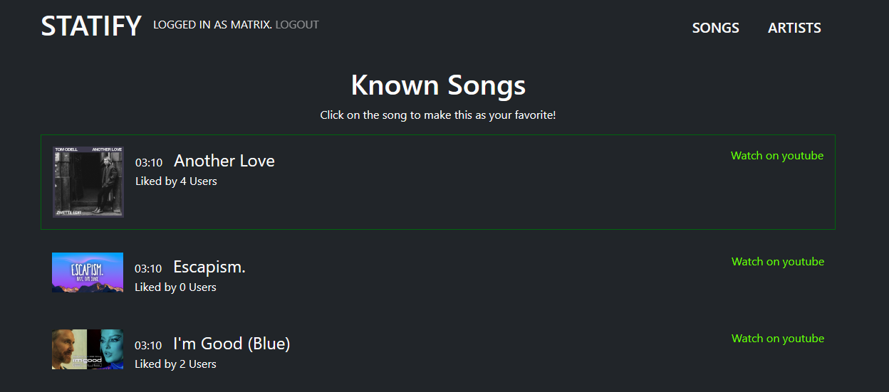

# Statify

Klone das Repository mit folgendem Befehl:

```
git clone https://github.com/lukasxux/Statify
```

## Kurzbeschreibung



Statify ist eine Webapplikation, die dem Nutzer seine Stats von Spotify anzeigen. Der Nutzer kann sich unter anderem seine meist gehörten Songs anschauen. Außerdem werden dem Nutzer seine meist gehörten Künstler angezeigt.

## Teammitglieder

| Name                    | Email                    | Aufgabenbereich                                                      |
| ----------------------- | ------------------------ | -------------------------------------------------------------------- |
| Lukas Hainzl,	    3CHIF | hai20266@spengergasse.at | Backend, Frontend, Sequenzdiagramm, Use-Case Login                   |
| Maximilian Bauer, 3CHIF | bau20220@spengergasse.at | Frontend, Use-Case Top Tracks(Button)                                |
| Raffael Rabl,     3CHIF | rab20362@spengergasse.at | Backend, Zeitaufzeichnung, Use-Case Logout, Lastenheft, Gnatt Chart  |
| Luca Racz,        3CHIF | rac20363@spengergasse.at | Frontend, README, wireframes / mockups, Use-Case Top Artists(Button) |

## Voraussetzungen

Das Projekt verwendet .NET in der Version >= 6. Prüfe mit folgendem Befehl, ob die .NET SDK in der
Version 6 oder 7 am Rechner installiert ist:

```
dotnet --version
```

Die .NET 6 SDK (LTS Version) kann von https://dotnet.microsoft.com/en-us/download/dotnet/6.0 für alle
Plattformen geladen werden.

Zum Prüfen der Docker Installation kann der folgende Befehl verwendet werden. Er muss die Version
zurückgeben:

```
docker --version
```

Im Startskript wird der Container geladen, bevor der Server gestartet wird.

## Starten des Programmes

Führe nach dem Klonen im Terminal den folgenden Befehl aus, um den Server zu starten.

**Windows**

```
startServer.cmd
```

**macOS, Linux**

```
chmod a+x startServer.sh
./startServer.sh
```

Nach dem Starten des Servers kann im Browser die Seite **http://localhost:5000**
aufgerufen werden. Falls die Meldung erscheint, dass das Zertifikat nicht geprüft werden kann,
muss mit *Fortsetzen* bestätigt werden.

